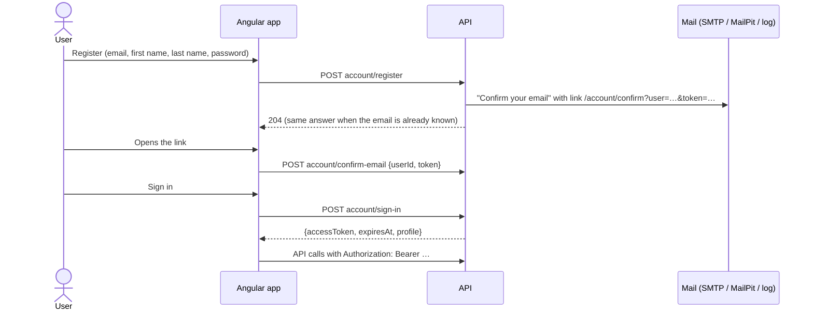

# User accounts

Meshtrail has its own accounts: register with email, first name, last name and a password, confirm the email address,
then sign in. The API hands out a signed access token (JWT); the Angular app sends it with every API call and to the
SignalR hub. The map is public: anyone can look at nodes and gateways without an account. Everything else (chat,
messages, registering nodes, gateways, teams) needs one.

## Flows

- **Register / resend confirmation / forgot password** always answer the same (204), so nobody can find out which
  email addresses have an account. A confirmed address that registers again gets a "you already have an account" mail.
- **Confirmation link**: valid 24 hours, one use. **Reset link**: valid 1 hour; resetting also confirms the email.
- **Sign in**: wrong email or password → 401 (one message for both); email not confirmed yet → 403; 5 wrong passwords
  lock the account for 15 minutes → 429.
- **Profile** (`/profile`): My gateways, My nodes, My teams and personal details (names can change, the email not).

## Endpoints (`api/v1/account`)

| Endpoint | Result |
|---|---|
| `POST register` `{email, firstName, lastName, password}` | 204; password at least 10 characters |
| `POST confirm-email` `{userId, token}` | 204; wrong or expired token → 422 |
| `POST resend-confirmation` `{email}` | 204 |
| `POST sign-in` `{email, password}` | `{accessToken, expiresAt, profile}`; 401 / 403 / 429 as above |
| `POST forgot-password` `{email}` | 204 |
| `POST reset-password` `{userId, token, password}` | 204; wrong or expired token → 422 |
| `GET me` / `PUT me` `{firstName, lastName}` | `ProfileDto` (needs a token) |

All account endpoints share a rate limit per IP address (`RateLimiting:AccountPerMinute`).

## Gateways and nodes belong to an account

- **Adding a gateway means choosing its node**: one of My nodes, or its id as the Meshtastic app shows it
  (`!f115aaec`). The MQTT login only works for that node; an uplink from another node with the login is ignored.
  Each gateway has its own login, so several gateways on one network are fine (an IP address would not work: the
  gateway connects to us, not the other way round).
- A node can be an active gateway **once**. Adding it again → 422 "remove it first". A node verified to another
  user cannot become your gateway.
- **The first uplink proves ownership**: when the chosen node uplinks with the login, it is registered to the gateway
  owner (unless someone already verified it). That is how you register your very first node: a code DM needs a gateway.
- Other nodes are registered with the contact link + code flow (see [Mesh/README.md](../Mesh/README.md)). A node can
  be registered once: remove it first to register it again.

## How it is built

| Part | Where |
|---|---|
| Business rules (tokens, lockout, names) | `Meshtrail.Core.Domain/Accounts/UserAccount.cs` |
| Use cases | `Meshtrail.Core.Application/UseCases/Accounts/` (commands, validators, mails in `AccountMails`) |
| Ports | `Abstractions/IAccountServices.cs`: `IPasswordHasher`, `IAccessTokenIssuer`, `ISecureTokenGenerator`, `IEmailSender`, `IClientLinks` |
| Password hashing | `PasswordHasher` wraps ASP.NET Core Identity's PBKDF2 hasher (old hashes are upgraded on sign-in) |
| Access tokens | `JwtAccessTokenIssuer`: HS256, claims `sub` (account id), `name`, `email` |
| Mail | `SmtpEmailSender` (MailPit locally), or `LogEmailSender` when no SMTP server is configured |
| Table | `UserAccounts` (unique `Email`, `RowVersion`) |
| Angular | `core/auth/` (session, interceptor, guard), `features/account/` (pages), `features/profile/` |

Tokens in links are 32 random bytes; only their SHA-256 hash is stored. The session (token + profile) is kept in the
browser's localStorage until it expires; a 401 signs the user out.

## Authentication modes (`Authentication:Mode`)

| Mode | Use |
|---|---|
| `Local` (default, also Development) | Our own JWTs from `account/sign-in` |
| `Development` (integration tests) | A `Bearer` token is checked like `Local`; without one the request is a fixed dev user, or the user in the `X-Dev-User` header |

## Configuration

| Key | Default | Meaning |
|---|---|---|
| `Authentication:Local:SigningKey` | — (a dev key in Development) | HS256 key, at least 32 characters. **Secret** in production |
| `Authentication:Local:Issuer` / `Audience` | `meshtrail` / `meshtrail` | Token issuer and audience |
| `Authentication:Local:TokenLifetime` | `12:00:00` | How long a sign-in lasts |
| `Authentication:Local:ClientBaseUrl` | `http://localhost:3000` | Where links in mails point to |
| `Email:From` | `Meshtrail <no-reply@meshtrail.local>` | Sender |
| `Email:SmtpHost` / `SmtpPort` / `SmtpEnableSsl` | — / `25` / `false` | SMTP server; the AppHost's MailPit connection string wins locally. Empty = mails go to the log |
| `RateLimiting:AccountPerMinute` | `30` | Account calls per IP per minute |

## Security

- Passwords: PBKDF2 (ASP.NET Core Identity format), never logged.
- Confirmation and reset tokens: random, hashed, short-lived, one use; compared in constant time.
- No account enumeration through register, resend or forgot password; one message for wrong email or password.
- Lockout after 5 wrong passwords; rate limit on all account endpoints.
- Production needs a real `SigningKey` (secret store) and an SMTP server; `LogEmailSender` writes links to the log.
