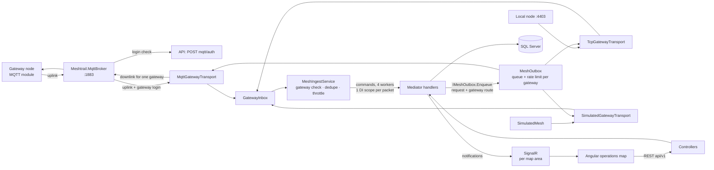
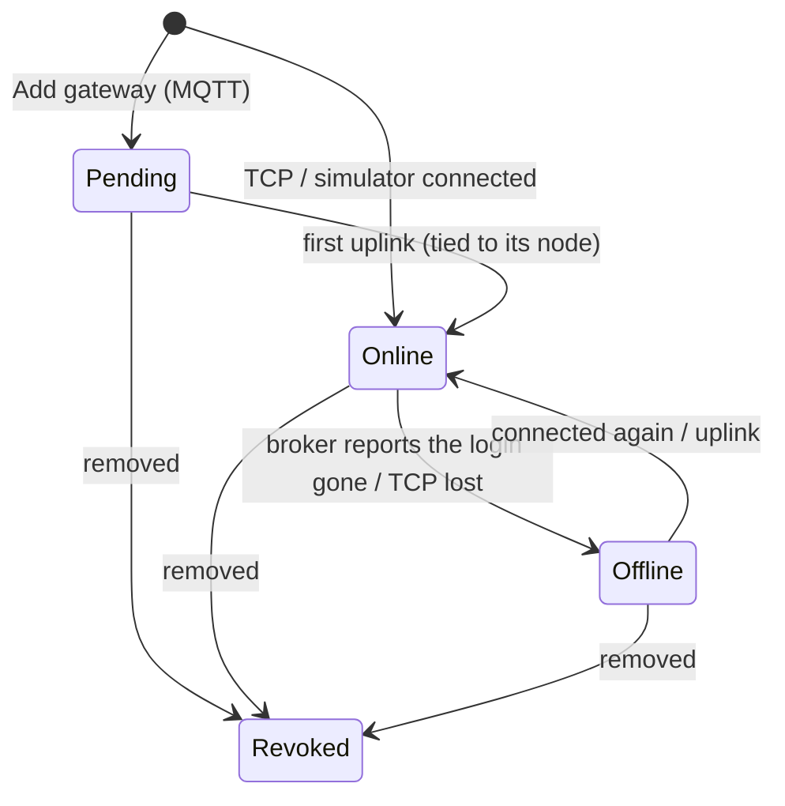
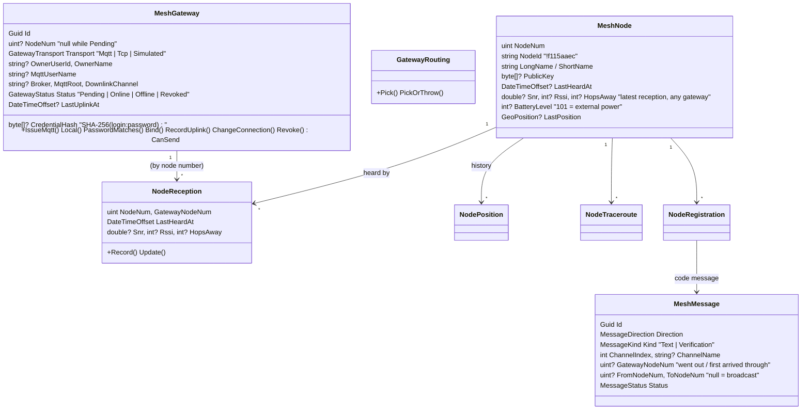

# Mesh — the Meshtastic platform

Meshtrail is one central platform for Meshtastic nodes anywhere in the world. It reaches the LoRa mesh through
**gateways**: ordinary nodes whose owners connected them to Meshtrail (normally over MQTT, through the node's own MQTT
module). This module covers everything from the radio packets up to the operations map: gateways, node discovery
("heard by" per gateway), registering nodes to users, and direct messages with delivery tracking. It works with every
Meshtastic device on stock firmware ≥ 2.5. Why it is built this way:
[gateway decisions](../Research/2026-10-03-mesh-gateway-decisions.md),
[multi-gateway over MQTT](../Research/2026-10-06-multi-gateway-mqtt.md),
[broker as a service](../Research/2026-10-06-mqtt-broker-service.md),
[multi-gateway core](../Research/2026-10-06-multi-gateway-core.md),
[teams and private chat](../Research/2026-10-09-teams-private-chat.md).

A LoRa packet only travels a few hops (default 3, max 7) around the gateway that sends it, so there is **no
worldwide channel**: we reach a node through a gateway that heard it recently. Group chat happens in **teams**, each
on its own Meshtastic channel.

## Where everything lives

| Piece | Location |
|---|---|
| Protocol (`.proto`, tag **v2.8.1**, GPL-3.0) | `Code/Libraries/Meshtrail.Mesh/Protos/meshtastic/` |
| Meshtrail SOS payload (`MeshtrailBeacon`) | `Code/Libraries/Meshtrail.Mesh/Protos/meshtrail/beacon.proto` |
| TCP stream framing | `Meshtrail.Mesh/Framing/` (`FrameReader`, `FrameWriter`, `MeshFrame`) |
| TCP radio | `Meshtrail.Mesh/Radio/` (`IMeshRadio`, `TcpMeshRadio`) |
| Simulator (several gateways) | `Meshtrail.Mesh/Simulation/SimulatedMesh.cs` |
| Protobuf → plain events | `Meshtrail.Mesh/Events/` (`PacketTranslator`, `MeshEvent` records) |
| Outbound packets + rate limit | `Meshtrail.Mesh/Outbound/` (`MeshPackets`, `OutboundRateLimiter`) |
| "Share contact" link parser | `Meshtrail.Mesh/Contacts/ContactUrl.cs` |
| MQTT broker, client, topics, user properties | `Meshtrail.Mesh/Mqtt/` (`MeshtasticMqttBroker`, `MeshtasticMqttClient`, `MeshtasticTopic`, `MeshtrailMqtt`) |
| MQTT broker service (AppHost resource `mqtt-broker`) | `Code/Server/Meshtrail.MqttBroker` (+ `ApiGatewayAuthenticator`) |
| Domain | `Meshtrail.Core.Domain/Mesh/` (`MeshGateway`, `NodeReception`, `GatewayRouting`, `MeshNode`, `NodePosition`, `NodeTraceroute`, `GeoPosition`, `NodeRegistration`, `MeshMessage`) |
| Teams (domain) | `Meshtrail.Core.Domain/Teams/Team.cs` |
| Use cases | `Meshtrail.Core.Application/UseCases/Gateways/`, `UseCases/Mesh/`, `UseCases/Teams/`, `UseCases/Map/` |
| Who may see a message | `Meshtrail.Core.Application/UseCases/Mesh/MessageAudience.cs` |
| Transports, ingest, outbox, health check | `Meshtrail.Core.Infrastructure/Mesh/` |
| Repositories, EF mapping | `Meshtrail.Core.Infrastructure/Repositories/`, `Persistence/` |
| Controllers | `Meshtrail.WebApi/Controllers/` (`GatewaysController`, `MqttAuthController`, `NodesController`, `MapController`, `RegistrationsController`, `MessagesController`, `TeamsController`) |
| Realtime (map-area groups) | `Meshtrail.WebApi/Realtime/` (`NotificationsHub.WatchArea`, `MapAreas`) |
| Angular | `Client-Web/src/app/features/operations/` (page, `gateways-panel`, `teams-panel`, `node-detail`, `chat-drawer`, `registration-dialog`), map wrapper `src/app/core/map/` |
| Tests | `Code/Tests/Meshtrail.Core.UnitTests/Mesh/`, `Code/Tests/Meshtrail.Core.IntegrationTests/Mesh/` |

`Meshtrail.Mesh` references nothing from `Meshtrail.Core`, so the broker service can use it on its own.

## Architecture



- **Transports** (`IGatewayTransport`): one per way in. MQTT (one per broker/region, `Meshtastic:Mqtt`), TCP (a local
  base station, `Meshtastic:Tcp`) and the simulator (`Meshtastic:Simulator`). They reconnect with growing pauses and
  never throw.
- **Ingest** (`MeshIngestService`, single router + `Ingest:Workers` workers):
  1. *Gateway check* — is this an accepted gateway (registered login, tied to this node)? Asked through
     `RecordGatewayUplink` at most once per `GatewayRefresh` (and on a new channel); rejected gateways' packets are
     dropped.
  2. Packets from our own virtual node, `via_mqtt` packets and `from = 0` are ignored.
  3. *Dedupe* — the same packet (sender + packet id) heard by several gateways within `DedupeWindow` is processed
     once; every gateway's reception is still recorded.
  4. *Throttle* — "gateway G heard node N" is written at most once per `HeardThrottle`.
  5. Direct messages between two other nodes are private and not ours: skipped. Only DMs and delivery reports to
     our addresses (the virtual node, or a TCP gateway itself) are processed.
  6. Commands go to a worker chosen by sender, so one node's packets stay in order.
- **Outbox** (`MeshOutbox` = `IMeshOutbox`): one queue and duty-cycle rate limit per gateway, started on first use.
  Handlers pick the gateway (`GatewayRoutes.PickAsync`) and enqueue a request with its `GatewayRoute`.
- Handlers never touch MQTT, sockets or protobuf.

### MQTT and the broker

```
<root>/2/e/<channel>/!<gatewayId>     ServiceEnvelope { packet, channel_id, gateway_id }   (uplink and downlink)
meshtrail/broker/gateways            { broker, userNames[] }  connected gateway logins (service logins only)
```

- **Gateways log in with their own credentials** (from "Add gateway"). The broker asks the API
  (`POST api/v1/mqtt/auth`, header `X-Meshtrail-Service-Key` = the service password) and caches a valid answer for a
  minute (a refused one for 10 s). The broker keeps no credentials itself, so it can run per region later.
- **Uplinks are stamped** with the gateway's login (MQTT 5 user property `meshtrail-gateway`); a property the
  gateway set itself is removed first, so nobody can pretend to be another gateway. The API binds the login to the
  `gateway_id` of its first uplink.
- **Downlinks are targeted**: the API sets `meshtrail-target = <login>` and the broker delivers it to that gateway
  only. Without it every gateway with downlink on that channel would transmit the packet.
- Routing rule: everything is delivered except gateway → gateway; gateways only receive Meshtastic topics a service
  login sent. Service logins (the API, MQTT Explorer) see everything.
- The broker publishes the connected logins on every connect/disconnect and every 30 s; the API marks MQTT gateways
  of that broker Online/Offline from it.
- Our downlinks carry `from = 0x4D545231` ("MTR1", `Outbound:VirtualNodeNum`), never the gateway's own number (the
  firmware drops "its own" packets coming back from MQTT). Hop limit `Outbound:HopLimit` (3). Replies and delivery
  reports come back addressed to the virtual node and are uplinked by the gateways that hear them.
- Gateways must have MQTT **encryption off**, so packets arrive decoded and the server never needs channel keys
  (TLS is mandatory in production). Direct messages over MQTT are therefore channel-encrypted on air, not
  PKI-encrypted: `add_contact` only works for TCP gateways.

### Adding a gateway

```mermaid
sequenceDiagram
    participant U as Owner (My gateways)
    participant API
    participant N as Owner's node
    participant B as Broker
    U->>API: POST gateways
    API-->>U: login gw-xxxxxxxxxx + password (shown once; only a hash is stored), setup instructions
    U->>N: MQTT settings: address, login, password, encryption off, root; channel uplink + downlink on
    N->>B: CONNECT gw-xxxxxxxxxx / password
    B->>API: POST mqtt/auth → allowed
    N->>B: first uplink on msh/EU_868/2/e/LongFast/!f115aaec
    B->>API: uplink + meshtrail-gateway = gw-xxxxxxxxxx
    API->>API: RecordGatewayUplink: Pending → Online, tied to !f115aaec
```

- One active gateway per node (filtered unique index). An older gateway on the same node with no owner or the same
  owner is replaced; another user's blocks ("This node is already a gateway of another user").
- A login can never move to another node: uplinks with that login from another `gateway_id` are dropped.
- Revoking a gateway makes its login fail on the next connect; the API ignores its uplinks within a minute.
- `Meshtastic:Mqtt:AcceptUnregisteredGateways` (development only) turns unknown logins into ownerless gateways.

### Sending a direct message

```mermaid
sequenceDiagram
    participant UI as Chat drawer
    participant API as SendMessage handler
    participant DB as MeshMessages
    participant O as Outbox (queue of gateway G)
    participant N as Mesh
    UI->>API: POST messages {toNodeNum, text}
    API->>API: pick gateway G (receptions of the node; 422 if none)
    API->>DB: insert (Queued, our packet id, via G, from MTR1)
    API->>O: Enqueue(TextMessageRequest via G)
    API-->>UI: 202 + MessageDto (Queued)
    O->>N: downlink to G only (want_ack)
    O->>DB: MarkMessageSent: Sent
    N-->>API: ROUTING_APP to MTR1 (request_id = packet id), uplinked by any gateway
    API->>DB: RecordRoutingResult: Acked or Failed
    DB-->>UI: MessageStatusChanged (SignalR)
```

**Picking the gateway** (`GatewayRouting.Pick`): only gateways that are Online and heard the node within 6 hours
(`ReachWindow`); receptions from the last 30 minutes first, then fewest hops, best SNR, most recent. None →
422 "No gateway can reach node !xxxxxxxx right now". Position requests, traceroutes and verification codes use the
same rule.

- **Acked** for a direct message only when the destination itself confirms; an "implicit" ack from a relay or the
  gateway only means the packet left, so it stays Sent.
- A routing error (`MaxRetransmit`, `NoRoute`, …) makes it **Failed** with that reason. No report within
  `Outbound:AckTimeout` (90 s) → Failed "No delivery confirmation". Still queued after `Outbound:QueueTimeout`
  (10 min, its gateway stayed offline) → Failed "The gateway stayed offline". Checked every 15 s.
- When a gateway comes back online, its queued messages are queued again; the outbox ignores a message it already
  holds, so nothing goes out twice.

### Teams and team chat

A team = a name, its own Meshtastic **channel name** and members (Owner / Member). The team puts that channel (same
name and key) on its nodes and on at least one gateway with uplink and downlink on; Meshtrail only knows the name,
never the key. People join with the 8-character **join code** (the owner can renew it).

- Channel names are 1–11 characters, unique across teams, and not a public preset (`LongFast`, `MediumSlow`, …):
  a team on a public channel would turn everyone's chat into "team chat".
- **Inbound:** a channel message whose channel name (from the gateway's MQTT topic) is a team's channel is stored as
  that team's chat and pushed to its members. Other channel messages are only stored (and deleted after
  `InboundBroadcastDays`).
- **Outbound:** one stored message, the same packet handed to **every online gateway that uplinked the channel in the
  last 24 hours** (`Team.ChannelFreshness`), each on the team channel. Where gateway areas overlap, nodes drop the
  second copy (same sender and packet id). No such gateway → 422. TCP gateways only know channel numbers, so they
  are not used for team chat.
- The last owner can only leave as the last member; then the team ends.

### Who may see what

| What | Who |
|---|---|
| Nodes, positions, gateways on the map | everybody |
| A team's chat | its members (others get 404) |
| A direct-message conversation with a node | the node's verified owner and everyone who wrote to it (others get an empty page) |
| A verification message | only the person registering (its text is never shown) |

`MessageAudience` decides this for the queries and for the realtime pushes (`MessageReceived`,
`MessageStatusChanged` go only to those users).

### Registering a node

The contact link flow is unchanged (claim → code by DM → verify), but the node must have been **heard by a gateway**
(422 otherwise) and the code goes out through the best gateway. After verification every online TCP gateway gets the
node's key (`add_contact`); MQTT gateways cannot use it for our packets.

### Gateway status



The `mesh-gateways` health check reports the transports (MQTT broker link, TCP node, simulator): **Degraded**, never
Unhealthy, while one is down, so `/health/ready` stays 200. It also reports inputs dropped because the ingest could
not keep up.

## The TCP stream protocol (local base station)

Every frame is `0x94 0xC3`, the payload length as 2 bytes big-endian (max 512), then the protobuf. On connect we send
`want_config_id`; the node answers with `my_info`, metadata, its node database, config and `config_complete_id`, then
live packets. A heartbeat every 5 minutes keeps the connection open. The node accepts **one TCP client at a time**
(the phone app or Home Assistant over WiFi kicks us off; we reconnect). MQTT does not have this limit. The TCP gateway
is a gateway like the others (Transport `Tcp`, no owner); DMs to it count as DMs to Meshtrail.

### What we do with incoming messages

| From the radio | Event | Command |
|---|---|---|
| `metadata` (TCP) | `GatewayInfoReceived` | `RecordGatewayInfo` (firmware) |
| `node_info` (TCP config dump) | `NodeInfoReceived` | `RecordNodeInfo` (+ reception) |
| any packet (also encrypted ones) | `NodeHeard` | `RecordNodeHeard` (node + reception per gateway, throttled) |
| `NODEINFO_APP` | `NodeUserReceived` | `RecordNodeUser` |
| `POSITION_APP` with a fix | `PositionReceived` | `RecordPosition` |
| `TELEMETRY_APP` device metrics | `TelemetryReceived` | `RecordTelemetry` |
| `TRACEROUTE_APP` with `request_id` | `TracerouteReceived` | `RecordTracerouteResult` |
| `TEXT_MESSAGE_APP` broadcast or to us | `TextReceived` (raw text) | `ReceiveTextMessage` (stored once; only DMs are pushed) |
| `ROUTING_APP` to us with `request_id` | `RoutingReceived` | `RecordRoutingResult` |
| DMs/acks between other nodes, config, channels (with keys), logs | — | ignored |

Packets from the gateway itself get no SNR/RSSI. Hops away = `hop_start − hop_limit`.

## Domain model



Rules worth knowing:

- Everything from the radio is untrusted: names and channel names are cleaned and cut, battery clamped to 0–101,
  keys that are not 32 bytes are ignored. Never rendered as HTML.
- Older reports never overwrite newer ones (last heard, position, reception). A time more than a minute in the future
  (drifting device clock) is replaced by our own time.
- Online node = heard in the last 15 minutes (`MeshNode.OnlineWindow`; the client uses the same rule).
- A user can have at most 20 gateways (`MeshGateway.MaxPerOwner`). Logins are never reused.
- One active registration per node; codes are 6 digits, 15 minutes, 5 attempts, stored as a hash.
- Outbound text is at most 200 bytes UTF-8. Direct messages go on the gateway's downlink channel: the first channel
  it uplinked (normally its primary channel).

## Database schema

Node numbers are uint32, stored as `BIGINT`. Scripts: `Code/Database/Meshtrail.Database/dbo/Tables/`.

**MeshGateways** — `Id` GUID PK (clustered on `CreatedAt`), `NodeNum` NULL, `Transport`, `OwnerUserId` /
`OwnerName` NULL, `MqttUserName` NULL (unique), `CredentialHash` VARBINARY(32) NULL, `Broker`, `MqttRoot`,
`DownlinkChannel` NULL, `Status`, `StatusChangedAt`, `LastUplinkAt`, `LastError`, `FirmwareVersion`, `CreatedAt`,
`RevokedAt`. Unique filtered index: one non-revoked gateway per `NodeNum`. Index on `OwnerUserId`.

**GatewayChannels** — (`GatewayId` FK, `ChannelName`) PK, `FirstSeenAt`, `LastSeenAt`. Names only, never keys.

**NodeReceptions** — (`NodeNum` FK, `GatewayNodeNum`) PK clustered, `LastHeardAt`, `Snr`, `Rssi`, `HopsAway`. Index on
(`GatewayNodeNum`, `LastHeardAt`).

**MeshNodes** — as before (names, key, last heard, signal, battery, last fix); index on `LastHeardAt` and a filtered
index on (`Latitude`, `Longitude`) for map views.

**NodePositions**, **NodeTraceroutes**, **NodeRegistrations** — unchanged.

**MeshMessages** — plus `ChannelName` NULL, `GatewayNodeNum` NULL, `CreatedById` NULL (author's user id, decides who
may read a conversation) and `TeamId` NULL (team chat; no FK, a message outlives its team). Index on (`TeamId`,
`CreatedAt`).

**Teams** — `Id` GUID PK, `Name`, `ChannelName` NVARCHAR(11) (unique), `JoinCode` NVARCHAR(8) (unique), `CreatedAt`,
`CreatedBy`. **TeamMembers** — (`TeamId` FK cascade, `UserId`) PK, `UserName`, `Role`, `JoinedAt`; index on `UserId`.

## API (`api/v1`)

| Endpoint | Result |
|---|---|
| `GET gateways?mine=true` | my gateways (pending included), with login and last error |
| `GET gateways` | every active, bound gateway (no private fields) |
| `GET gateways/summary` | `{online, total}` for the chip |
| `POST gateways` | 201 `GatewayCredentialsDto` (login, password once, MQTT setup) |
| `DELETE gateways/{id}` | 204; someone else's gateway answers 404 |
| `POST mqtt/auth` | internal (broker), needs `X-Meshtrail-Service-Key`; `{allowed}` |
| `GET nodes?bbox=w,s,e,n&search&online&registered&owner=me&page&pageSize` | `PagedResult<NodeDto>`, most recently heard first (max 500) |
| `GET nodes/{nodeNum}` | `NodeDetailDto` (node, last traceroute, `heardBy` best first) |
| `POST nodes/{nodeNum}/position-request` | 202, or 422 when no gateway can reach it |
| `POST nodes/{nodeNum}/traceroute` | 202 + pending traceroute |
| `GET map/features?bbox=w,s,e,n&layers=nodes,gateways` | GeoJSON; the nodes layer returns at most 5000 (most recent) |
| `GET registrations`, `POST registrations/from-contact-url`, `POST registrations/{id}/verify`, `DELETE registrations/{id}` | as before |
| `GET messages?node={nodeNum}` or `?team={id}` | one conversation or one team chat, newest first (verification messages left out); see "Who may see what" |
| `POST messages` `{toNodeNum, text}` or `{teamId, text}` | 202 + Queued `MessageDto`; broadcast address → 400; no gateway → 422 |
| `GET teams` | my teams (channel, join code, members, `gatewaysOnline`) |
| `POST teams` `{name, channelName}` | 201, you are the owner; 422 public or taken channel |
| `POST teams/join` `{code}` | you are a member; 404 unknown code |
| `POST teams/{id}/join-code` | owner: a new join code |
| `DELETE teams/{id}/members/me` | 204, you left (the last member ends the team) |

In Development/Testing an `X-Dev-User` header signs in as another user (tests act as several people).

### Realtime (SignalR `/hubs/notifications`)

Clients call `WatchArea(west, south, east, north)` whenever the map moves. The world is cut into 5° tiles (SignalR
groups); a view of more than 48 tiles joins the "world" group.

| Event | Payload | Who gets it |
|---|---|---|
| `NodeUpdated` | `NodeDto` | browsers watching the node's area (nodes without a position are not pushed) |
| `GatewayStatusChanged` | `GatewayDto` (no private fields) | everyone |
| `TracerouteCompleted` | `NodeTracerouteDto` | everyone |
| `MessageReceived` | `MessageDto` | only the people who may see it (team members, or the conversation's people) |
| `MessageStatusChanged` | `MessageDto` | only the people who may see it |

### Map layers

`nodes` (`NodesMapLayer`) and `gateways` (`GatewaysMapLayer`, at their node's position, with `status`). A new layer is
a new `IMapLayerSource` registered in `AddApplication`.

## Operations map (Angular)

- **Top bar**: `GATEWAYS online/total` chip (green all online, amber some offline, red none; opens My gateways),
  **My gateways**, **Teams**, **Register node**, counts of nodes in view / online.
- **Left**: layer toggles (nodes, gateways), worldwide search (name or `!id`), "Only my nodes", and the node list:
  nodes **in the map view**, or the search results when searching.
- **Map**: loads per view (`moveend`), nodes cluster into numbered circles when zoomed out (click to zoom in),
  gateways are rings coloured by status. Live updates come only for the area in view.
- **Right**: node detail (with **Heard by**, the gateway marked VIA is the one messages go through) or **My
  gateways**: add a gateway (login + password shown once, with the MQTT settings to enter in the Meshtastic app),
  see status, last message and channels, remove (two-step).
- **Teams panel**: your teams (channel, join code to copy, members, whether a gateway carries the channel), create a
  team, join with a code, renew the code (owner), leave (two-step).
- **Bottom**: a tab per team (always) and per direct-message conversation. A team tab warns when no online gateway
  carries its channel.
- `core/map/map-view.ts` is the only code that uses MapLibre. Cluster numbers need a font: the built-in style uses
  MapLibre's demo glyphs; a style without `glyphs` shows the circles without numbers. A web server must serve `.mjs`
  as `text/javascript`.

## Simulator

`SimulatedMesh` (development and tests) fakes **three gateways** around Belgium with 60 km range — Leuven
`!5101aaec`, Ghent `!5101aaed`, Ardennes `!5101aaee` — and five hikers (Brussels, Ghent, Durbuy, La Roche,
Bouillon). Ranges overlap: Sim Brussels is heard by two gateways. Every packet reaches each gateway in range with its
own SNR and hop count. Downlinks behave like MQTT: only nodes in range of the transmitting gateway answer (ACKs,
"Copy." replies, positions, traceroutes); unreachable DMs get `MAX_RETRANSMIT`.

For load tests raise `Simulator:GatewayCount` (extra gateways spread over Europe, `NodesPerExtraGateway` nodes each)
and `EventsPerTick`. The simulator logs each hiker's contact link and every DM a fake node receives (codes too), so
the registration flow works without hardware.

## Configuration

| Key | Default | Meaning |
|---|---|---|
| `Meshtastic:Mqtt:Enabled` | `false` (`true` in Development) | Log in to the Meshtrail broker |
| `Meshtastic:Mqtt:Broker` | `local` | Broker (region) name; must match `MqttBroker:Name` |
| `Meshtastic:Mqtt:Host` / `Port` | `localhost` / `1883` | Where the API reaches the broker |
| `Meshtastic:Mqtt:UserName` / `Password` | `meshtrail-api` / — | Service login (= `MqttBroker:ServicePassword`); also the service key of `mqtt/auth`. Secret |
| `Meshtastic:Mqtt:Root` / `DefaultChannel` | `msh/EU_868` / `LongFast` | Root topic new gateways are told to use; downlink defaults |
| `Meshtastic:Mqtt:PublicHost` / `PublicPort` / `UseTls` | — / `1883` / `false` | What the setup instructions show |
| `Meshtastic:Mqtt:AcceptUnregisteredGateways` | `false` | Development only: unknown logins become ownerless gateways |
| `Meshtastic:Tcp:Host` / `Port` | — / `4403` | A local TCP node. Empty = no TCP gateway. **User secrets only** |
| `Meshtastic:Simulator:Enabled` | `false` (`true` in Development) | The fake multi-gateway mesh |
| `Meshtastic:Simulator:GatewayCount` / `EventsPerTick` / `TickInterval` | `3` / `1` / `00:00:15` | Simulator size and traffic |
| `Meshtastic:Outbound:MinInterval` | `00:00:10` | Pause between two packets of one gateway (EU868 duty cycle) |
| `Meshtastic:Outbound:AckTimeout` / `QueueTimeout` | `00:01:30` / `00:10:00` | When sent / queued messages become Failed |
| `Meshtastic:Outbound:VirtualNodeNum` / `HopLimit` | `1297371697` (`!4d545231`) / `3` | Our sender number and hop limit on MQTT |
| `Meshtastic:Ingest:DedupeWindow` / `HeardThrottle` / `GatewayRefresh` / `Workers` | `10 min` / `1 min` / `1 min` / `4` | Ingest guardrails |
| `Meshtastic:Retention:PositionDays` / `InboundBroadcastDays` | `30` / `30` | Deleted by the `NodePositionRetention` job |

Broker service (`MqttBroker` section):

| Key | Default | Meaning |
|---|---|---|
| `Name` | `local` | Broker (region) name |
| `Port` / `BindAddress` | `1883` / `0.0.0.0` | Where gateways connect |
| `ServiceUserName` / `ServicePassword` | `meshtrail-api` / — | Service login (API, MQTT Explorer). Development: `dev-only-service-password` |
| `Api:Url` / `Api:CacheDuration` | `https+http://api` / `00:01:00` | Where gateway logins are checked (service discovery; Development falls back to https://localhost:7301) |
| `AllowAnyGateway` | `false` | Troubleshooting only: accept any login without asking the API |
| `MaxMessagesPerSecondPerGateway` | `20` | Extra messages are dropped |
| `ConnectionsInterval` | `00:00:30` | How often the connected logins are sent to the API |
| `LogUplinks` | `false` (`true` in Development) | One log line per uplink |

## Connecting a real node as a gateway

1. Start the AppHost. Allow port 1883 in the Windows firewall.
2. Operations → **My gateways** → **Add gateway**. Copy the login and password (shown once).
3. In the Meshtastic app → Settings → Module configuration → **MQTT**: enabled, address = your PC's IP on the LAN
   (not `localhost`), the login and password, **encryption off**, JSON off, TLS off, root topic as shown.
   Channels → primary channel: **uplink and downlink on**. (MQTT is independent of the node's TCP API, so Home
   Assistant can stay connected over TCP.)
4. The gateway turns Online with its first uplink; its node and the nodes it hears appear on the map.
5. To look inside the broker use **MQTT Explorer**: host `localhost`, port `1883`, no TLS, username
   `meshtrail-api`, password `dev-only-service-password` (Development). Any other login is treated as a gateway and
   sees nothing.

A local TCP base station is still possible: `dotnet user-secrets set "Meshtastic:Tcp:Host" "<node-ip>" --project
Code/Server/Meshtrail.WebApi`. Do not connect the phone app over WiFi/TCP at the same time.

## Security

- Channel keys (PSKs) are never logged or stored: channel and config frames are ignored; gateways send decoded
  packets (encryption off), so TLS is required in production.
- Gateway passwords are random (24 characters), shown once, stored as SHA-256 and compared in constant time. The
  broker checks logins with the API using the service key; the key comparison is constant time too.
- Uplinks carry the gateway login stamped by the broker (gateways cannot fake it), and a login stays tied to one
  node. This proves control of the credentials, not of the radio itself: a custom MQTT client could claim any
  gateway id on its first uplink.
- Direct messages between other nodes are never stored. Positions and nodes are public; registrations, gateway
  logins and errors are per user (someone else's answers 404 or leaves the private fields out).
- Text and names arriving from the radio are untrusted input: cleaned and length-limited in the domain, and never
  rendered as HTML.
