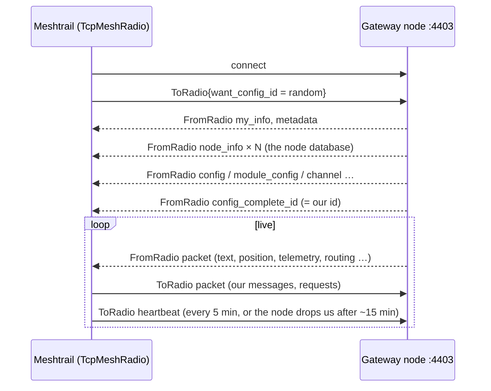

# Mesh — talking to the Meshtastic network

Meshtrail reaches a LoRa mesh of Meshtastic devices through **one gateway node** on the local WiFi. This module
covers everything from the bytes on the TCP socket up to the protocol messages. It works with every Meshtastic
device on stock firmware ≥ 2.5, not only Meshtrail devices. Why it is built this way:
[decision record](../Research/2026-10-03-mesh-gateway-decisions.md).

## Where everything lives

| Piece | Location |
|---|---|
| Protocol (`.proto`, tag **v2.8.1**, GPL-3.0) | `Code/Libraries/Meshtrail.Mesh/Protos/meshtastic/` |
| Meshtrail SOS payload (`MeshtrailBeacon`) | `Code/Libraries/Meshtrail.Mesh/Protos/meshtrail/beacon.proto` |
| Stream framing | `Meshtrail.Mesh/Framing/` (`FrameReader`, `FrameWriter`, `MeshFrame`) |
| Radio abstraction | `Meshtrail.Mesh/Radio/IMeshRadio.cs` |
| Real node over WiFi | `Meshtrail.Mesh/Radio/TcpMeshRadio.cs` |
| Fake mesh (no hardware) | `Meshtrail.Mesh/Radio/SimulatedMeshRadio.cs` |
| "Share contact" link parser | `Meshtrail.Mesh/Contacts/ContactUrl.cs` |
| Console probe | `Code/Tools/Meshtrail.MeshProbe` |
| Tests | `Code/Tests/Meshtrail.Core.UnitTests/Mesh/` |

`Meshtrail.Mesh` references nothing from `Meshtrail.Core`, so it can be used on its own (the probe does).

## The TCP stream protocol



Every frame is `0x94 0xC3`, then the payload length as 2 bytes big-endian (max 512), then the protobuf.
`FrameReader` keeps leftovers between reads, skips anything before a start marker (debug text, corrupt bytes)
and throws away a header that claims more than 512 bytes, then looks for the next marker.

The node accepts **one TCP client at a time**. When the phone app connects over WiFi, we are disconnected and
`ReadAllAsync` ends; the caller reconnects later.

## Simulator

`SimulatedMeshRadio` fakes a gateway (`!5101aaec`) and five nodes around Belgium (Brussels, Ghent, Durbuy,
La Roche, Bouillon). On connect it sends the same config dump a real node sends. Then, every
`SimulatorTickInterval`, a random node moves ~50 m and sends a position, a battery report or a chat line.
It answers what we send: routing ACKs for messages (`MAX_RETRANSMIT` for unknown nodes), "Copy." replies to DMs,
positions for position requests, a route for traceroutes. `RaiseSos(nodeNum?)` makes a node send an SOS text.

## Configuration (`Meshtastic:Gateway`)

| Key | Default | Meaning |
|---|---|---|
| `Mode` | `Tcp` | `Tcp` = real node, `Simulated` = fake mesh |
| `Host` | — | IP or host name of the gateway node. **User secrets only, never committed** |
| `Port` | `4403` | Meshtastic TCP API port |
| `HeartbeatInterval` | `00:05:00` | Heartbeat so the node keeps the connection open |
| `ConnectTimeout` | `00:00:10` | Give up a connection attempt after this |
| `SimulatorTickInterval` | `00:00:15` | How often the simulator invents traffic |

## Connecting a real node

1. Flash stock Meshtastic firmware (≥ 2.5) and set region `EU_868` with the phone app over Bluetooth or USB.
2. In the app: *Config → Network*: enable WiFi, enter SSID and password. On ESP32 boards **WiFi switches Bluetooth
   off**, so do all other configuration first (or use USB / the web client afterwards).
3. Find the node's IP address (router DHCP list, or the node's screen if it has one).
4. Check it with the probe (prints the node info, the node database, then every packet; never channel keys):
   ```bash
   dotnet run --project Code/Tools/Meshtrail.MeshProbe -- --host <node-ip>
   dotnet run --project Code/Tools/Meshtrail.MeshProbe -- --simulated     # no hardware
   ```
5. Do not connect the phone app over WiFi/TCP at the same time: the node only serves one TCP client.

## Security

- Channel keys (PSKs) are never logged or stored. The probe prints only channel index, role and name.
- Public keys of nodes are public and may be stored.
- Text and names arriving from the radio are untrusted input: length-limit them and never render them as HTML.
