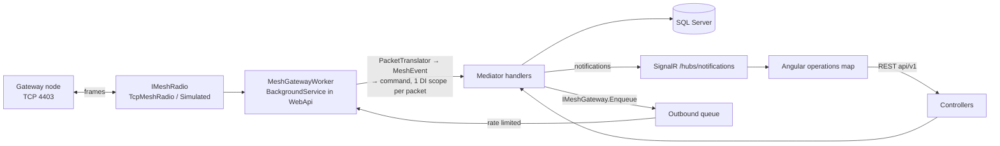
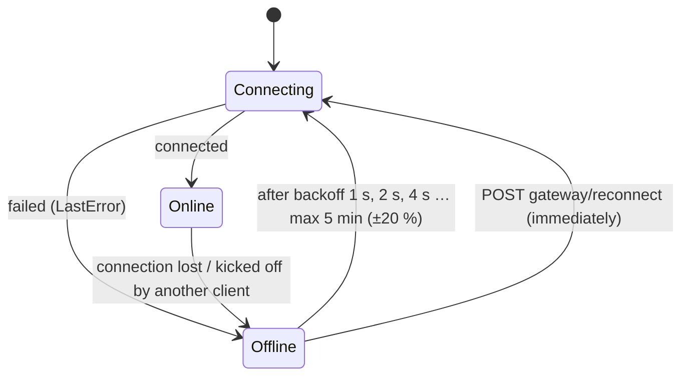
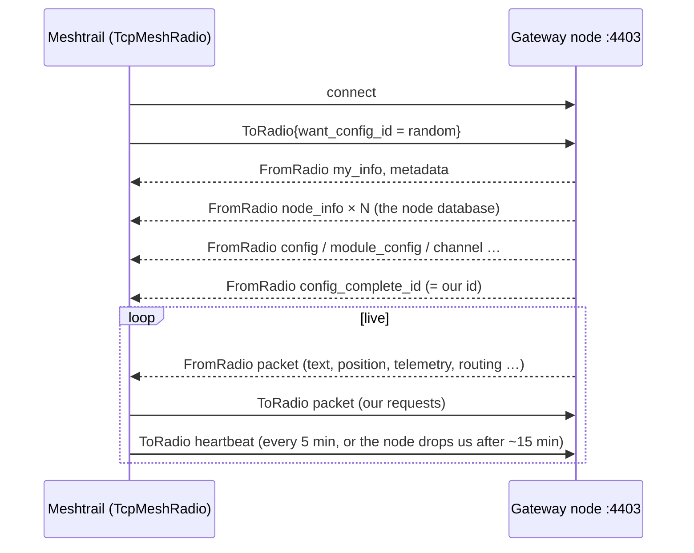
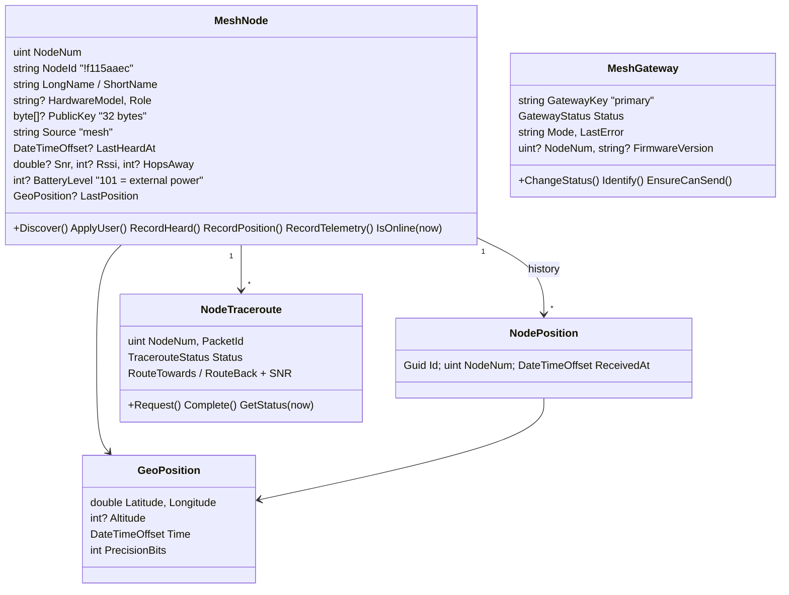

# Mesh — talking to the Meshtastic network

Meshtrail reaches a LoRa mesh of Meshtastic devices through **one gateway node** on the local WiFi. This module
covers everything from the bytes on the TCP socket up to the nodes on the operations map. It works with every
Meshtastic device on stock firmware ≥ 2.5, not only Meshtrail devices. Why it is built this way:
[decision record](../Research/2026-10-03-mesh-gateway-decisions.md).

## Where everything lives

| Piece | Location |
|---|---|
| Protocol (`.proto`, tag **v2.8.1**, GPL-3.0) | `Code/Libraries/Meshtrail.Mesh/Protos/meshtastic/` |
| Meshtrail SOS payload (`MeshtrailBeacon`) | `Code/Libraries/Meshtrail.Mesh/Protos/meshtrail/beacon.proto` |
| Stream framing | `Meshtrail.Mesh/Framing/` (`FrameReader`, `FrameWriter`, `MeshFrame`) |
| Radio abstraction + implementations | `Meshtrail.Mesh/Radio/` (`IMeshRadio`, `TcpMeshRadio`, `SimulatedMeshRadio`) |
| Protobuf → plain events | `Meshtrail.Mesh/Events/` (`PacketTranslator`, `MeshEvent` records) |
| Outbound packets + rate limit | `Meshtrail.Mesh/Outbound/` (`MeshPackets`, `OutboundRateLimiter`) |
| "Share contact" link parser | `Meshtrail.Mesh/Contacts/ContactUrl.cs` |
| Domain | `Meshtrail.Core.Domain/Mesh/` (`MeshNode`, `MeshGateway`, `NodePosition`, `NodeTraceroute`, `GeoPosition`) |
| Use cases | `Meshtrail.Core.Application/UseCases/Mesh/` and `UseCases/Map/` |
| Gateway worker, event → command mapping, health check | `Meshtrail.Core.Infrastructure/Mesh/` |
| Repositories, EF mapping | `Meshtrail.Core.Infrastructure/Repositories/Mesh*`, `Persistence/*Mesh*`, `*Node*` |
| Controllers | `Meshtrail.WebApi/Controllers/` (`GatewayController`, `NodesController`, `MapController`) |
| Angular | `Client-Web/src/app/features/operations/`, map wrapper `src/app/core/map/` |
| Console probe | `Code/Tools/Meshtrail.MeshProbe` |
| Tests | `Code/Tests/Meshtrail.Core.UnitTests/Mesh/`, `Code/Tests/Meshtrail.Core.IntegrationTests/Mesh/` |

`Meshtrail.Mesh` references nothing from `Meshtrail.Core`, so it can be used on its own (the probe does).
Infrastructure adapts it to the application.

## Architecture



- The worker owns the radio. It never throws: a failed packet is logged and skipped; a lost connection is retried.
- Handlers never touch the radio: they queue work through `IMeshGateway` (Application port, implemented by
  `MeshGatewayService`). The worker sends queued requests no faster than `Meshtastic:Outbound:MinInterval`.
- We pick packet ids ourselves (`MeshPackets.NewPacketId`), so an answer (`request_id`) can be matched to a request
  that was stored before it was sent (traceroutes).

### Gateway connection



The status is stored in `MeshGateways` (for the API) and kept in memory for the `mesh-gateway` health check.
That check reports **Degraded** (never Unhealthy) while offline, so `/health/ready` stays 200.

## The TCP stream protocol



Every frame is `0x94 0xC3`, then the payload length as 2 bytes big-endian (max 512), then the protobuf.
`FrameReader` keeps leftovers between reads, skips anything before a start marker (debug text, corrupt bytes)
and throws away a header that claims more than 512 bytes, then looks for the next marker.

The node accepts **one TCP client at a time**. When the phone app connects over WiFi, we are disconnected and
`ReadAllAsync` ends; the worker reconnects later.

### What we do with incoming messages

| From the radio | Event | Command |
|---|---|---|
| `my_info`, `metadata` | `GatewayInfoReceived` | `RecordGatewayInfo` |
| `node_info` (config dump) | `NodeInfoReceived` | `RecordNodeInfo` |
| any packet (also encrypted ones) | `NodeHeard` | `RecordNodeHeard` |
| `NODEINFO_APP` | `NodeUserReceived` | `RecordNodeUser` |
| `POSITION_APP` with a fix | `PositionReceived` | `RecordPosition` |
| `TELEMETRY_APP` device metrics | `TelemetryReceived` | `RecordTelemetry` |
| `TRACEROUTE_APP` with `request_id` | `TracerouteReceived` | `RecordTracerouteResult` |
| config, channels (with keys), module config, logs | — | ignored |

Packets from the gateway itself get no SNR/RSSI (they did not travel over the air). Hops away = `hop_start − hop_limit`.

## Domain model



Rules worth knowing:

- Everything from the radio is untrusted: names are cleaned (control characters removed, max 40 / 10 characters),
  battery is clamped to 0–101, keys that are not 32 bytes are ignored, routes are cut at 8 hops.
- Older reports never overwrite newer ones (last heard, position time). A "heard" time more than a minute in the
  future (drifting device clock) is replaced by our own time.
- Online = heard in the last 15 minutes (`MeshNode.OnlineWindow`; the client uses the same rule).
- Battery 101 means "on external power" (`IsExternalPower`); the UI shows that instead of a percentage.
- A traceroute without an answer after 2 minutes shows as `TimedOut` (derived, not stored).
- Requests to the mesh need an Online gateway (`MeshGateway.EnsureCanSend` → 422 otherwise).

## Database schema

Node numbers are uint32, stored as `BIGINT` (they do not fit in `INT`). Scripts: `Code/Database/Meshtrail.Database/dbo/Tables/`.

**MeshGateways** — `GatewayKey` NVARCHAR(50) PK, `Mode` NVARCHAR(20), `Status` NVARCHAR(20), `StatusChangedAt`,
`LastConnectedAt` NULL, `LastError` NVARCHAR(500) NULL, `NodeNum` BIGINT NULL, `FirmwareVersion` NVARCHAR(50) NULL.

**MeshNodes**

| Column | Type | Null | Notes |
|---|---|---|---|
| NodeNum | BIGINT | no | PK (clustered) |
| NodeId | NVARCHAR(9) | no | `!` + 8 hex digits |
| LongName / ShortName | NVARCHAR(40) / NVARCHAR(10) | no | firmware defaults until the node sends its user info |
| HardwareModel / Role | NVARCHAR(50) / NVARCHAR(30) | yes | |
| PublicKey | VARBINARY(32) | yes | public by design |
| Source | NVARCHAR(20) | no | `mesh` |
| FirstSeenAt / LastHeardAt | DATETIMEOFFSET | no / yes | index on LastHeardAt |
| Snr, Rssi, HopsAway | FLOAT, INT, INT | yes | |
| BatteryLevel, Voltage | INT, FLOAT | yes | 101 = external power |
| Latitude, Longitude, Altitude, PositionTime, PositionPrecision | | yes | last fix |
| UpdatedAt | DATETIMEOFFSET | no | |

**NodePositions** — `Id` GUID PK (nonclustered), `NodeNum` FK, `Latitude`, `Longitude`, `Altitude` NULL,
`PositionTime` NULL, `Precision`, `ReceivedAt`. Clustered on (`NodeNum`, `ReceivedAt`), index on `ReceivedAt`
for the retention job.

**NodeTraceroutes** — `Id` GUID PK, `NodeNum` FK, `PacketId` BIGINT (indexed), `Status`, `RequestedAt`,
`RequestedBy`, `CompletedAt` NULL, `RouteTowards` / `SnrTowards` / `RouteBack` / `SnrBack` NVARCHAR(400)
(comma-separated, empty SNR = unknown).

## API (`api/v1`)

| Endpoint | Result |
|---|---|
| `GET gateway` | `GatewayStatusDto` (status, mode, last error, node id, firmware) |
| `POST gateway/reconnect` | 202; new status arrives via SignalR |
| `GET nodes?page&pageSize&search&online&registered` | `PagedResult<NodeDto>`, most recently heard first (max 500 per page) |
| `GET nodes/{nodeNum}` | `NodeDetailDto` (node + last traceroute); 404 if unknown |
| `POST nodes/{nodeNum}/position-request` | 202; the answer updates the node (NodeUpdated) |
| `POST nodes/{nodeNum}/traceroute` | 202 + pending `NodeTracerouteDto`; result via TracerouteCompleted |
| `GET map/features?bbox=w,s,e,n&layers=nodes` | GeoJSON FeatureCollection |

Errors: 400 validation (e.g. broadcast address `4294967295`), 404 unknown node, 422 gateway not online.

### Realtime (SignalR `/hubs/notifications`)

| Event | Payload | When |
|---|---|---|
| `NodeUpdated` | `NodeDto` | after any change to a node |
| `GatewayStatusChanged` | `GatewayStatusDto` | connection state or gateway identity changed |
| `TracerouteCompleted` | `NodeTracerouteDto` | answer to a traceroute arrived |

### Map layers

`GET map/features` asks every registered `IMapLayerSource` (Application, `UseCases/Map/`) for features. Today there
is one layer, `nodes`. Feature ids are `<layer>:<id>`; every feature has `layer` and `source` properties. A new
layer (tracking, external feeds) = a new `IMapLayerSource` registered in `AddApplication`; the endpoint and the
client's layer toggles stay the same. The mesh domain knows nothing about the map.

## Operations map (Angular)

`/operations` (start page): top bar with the gateway chip (Reconnect button when offline) and node counts; left
panel with layer toggles and the node list (search, online dot, GW badge); centre the topo map; right the node
detail with **Request position** and **Traceroute**. Everything updates via SignalR, nothing polls.

- `core/map/map-view.ts` is the **only** code that uses MapLibre, so the map library can be swapped in one place.
- Style: `environment.mapStyleUrl`; empty = built-in OpenTopoMap raster style (needs internet; offline tiles later).
- MapLibre's web worker is copied to `/maplibre/` by `angular.json`. A web server must serve `.mjs` files as
  `text/javascript`, otherwise the map stays empty ("Worker failed to load").
- Marker colour by last heard: green < 15 min, yellow < 2 h, orange < 24 h, grey older/never.
- Radio texts are always rendered with interpolation, never as HTML.

## Simulator

`SimulatedMeshRadio` fakes a gateway (`!5101aaec`) and five nodes around Belgium (Brussels, Ghent, Durbuy,
La Roche, Bouillon). On connect it sends the same config dump a real node sends. Then, every
`SimulatorTickInterval`, a random node moves ~50 m and sends a position, a battery report or a chat line.
It answers what we send: routing ACKs for messages (`MAX_RETRANSMIT` for unknown nodes), "Copy." replies to DMs,
positions for position requests, a route for traceroutes. `RaiseSos(nodeNum?)` makes a node send an SOS text.
Development uses it by default (`appsettings.Development.json`).

## Configuration

| Key | Default | Meaning |
|---|---|---|
| `Meshtastic:Gateway:Mode` | `Tcp` (`Simulated` in Development) | `Tcp` = real node, `Simulated` = fake mesh |
| `Meshtastic:Gateway:Host` | — | IP or host name of the gateway node. **User secrets only, never committed** |
| `Meshtastic:Gateway:Port` | `4403` | Meshtastic TCP API port |
| `Meshtastic:Gateway:HeartbeatInterval` | `00:05:00` | Heartbeat so the node keeps the connection open |
| `Meshtastic:Gateway:ConnectTimeout` | `00:00:10` | Give up a connection attempt after this |
| `Meshtastic:Gateway:SimulatorTickInterval` | `00:00:15` | How often the simulator invents traffic |
| `Meshtastic:Outbound:MinInterval` | `00:00:10` | Minimum pause between two packets we send (EU868 duty cycle) |
| `Meshtastic:Retention:PositionDays` | `30` | Position history older than this is deleted |
| `Jobs:NodePositionRetention:Enabled` / `Cron` | `true` / `15 3 * * *` | Schedule of that clean-up |

With `Mode=Tcp` and no `Host`, the gateway stays Offline with "No gateway host configured" (the API still works).

## Connecting a real node

1. Flash stock Meshtastic firmware (≥ 2.5) and set region `EU_868` with the phone app over Bluetooth or USB.
2. In the app: *Config → Network*: enable WiFi, enter SSID and password. On ESP32 boards **WiFi switches Bluetooth
   off**, so do all other configuration first (or use USB / the web client afterwards).
3. Find the node's IP address (router DHCP list) and give it a fixed lease.
4. Check it with the probe (prints the node info, the node database, then every packet; never channel keys):
   ```bash
   dotnet run --project Code/Tools/Meshtrail.MeshProbe -- --host <node-ip>
   dotnet run --project Code/Tools/Meshtrail.MeshProbe -- --simulated     # no hardware
   ```
5. Point the API at it:
   ```bash
   dotnet user-secrets set "Meshtastic:Gateway:Mode" "Tcp" --project Code/Server/Meshtrail.WebApi
   dotnet user-secrets set "Meshtastic:Gateway:Host" "<node-ip>" --project Code/Server/Meshtrail.WebApi
   ```
6. Do not connect the phone app over WiFi/TCP at the same time: the node only serves one TCP client. If it took
   over, close it and press **Reconnect** in the top bar.

## Security

- Channel keys (PSKs) are never logged or stored: channel and config frames are ignored. The probe prints only
  channel index, role and name.
- Public keys of nodes are public and may be stored.
- Text and names arriving from the radio are untrusted input: cleaned and length-limited in the domain, and never
  rendered as HTML.
