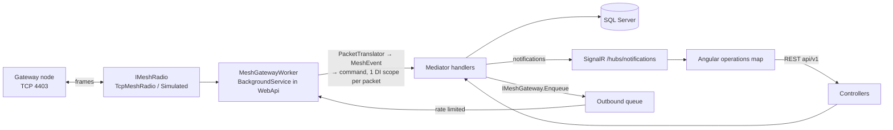
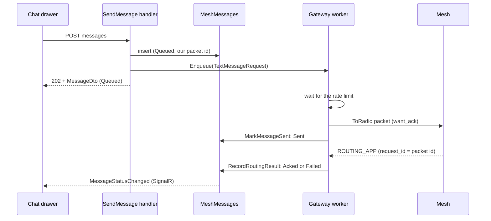
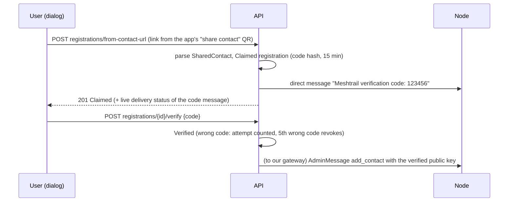
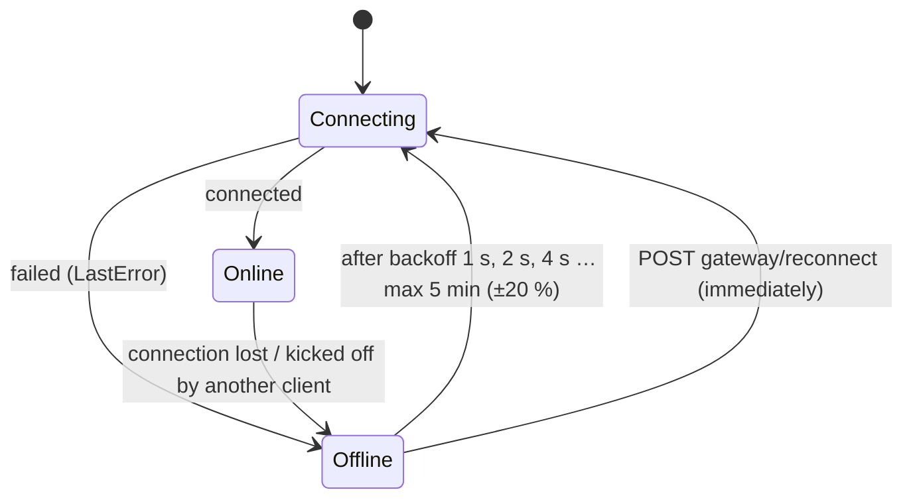
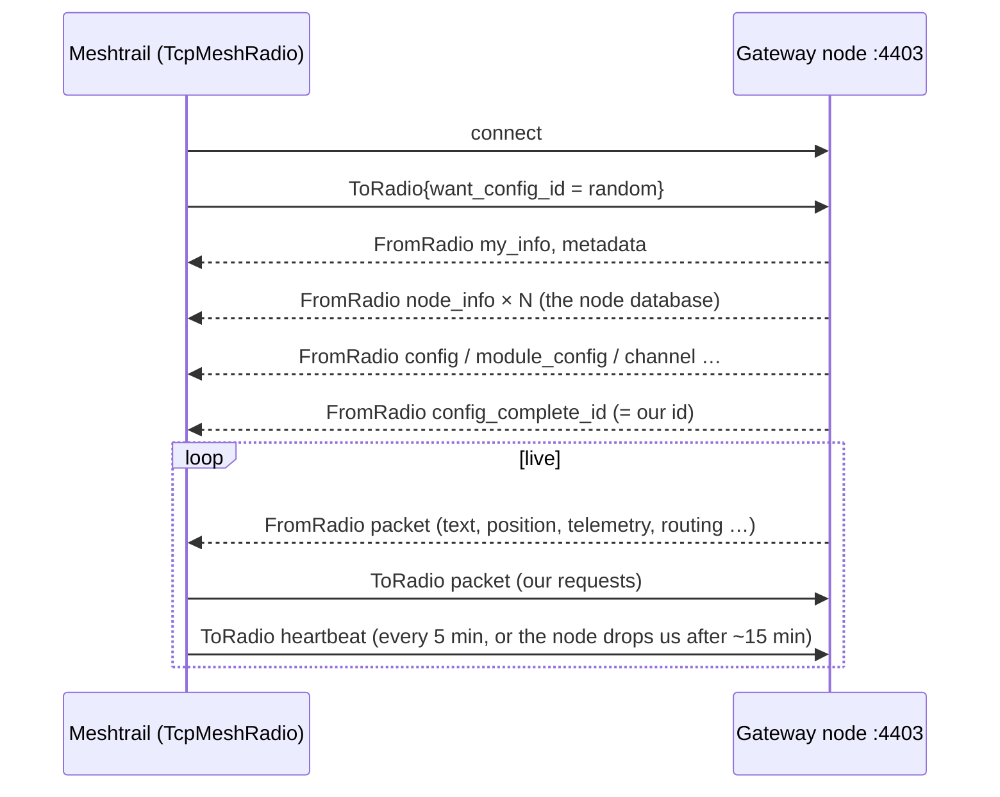
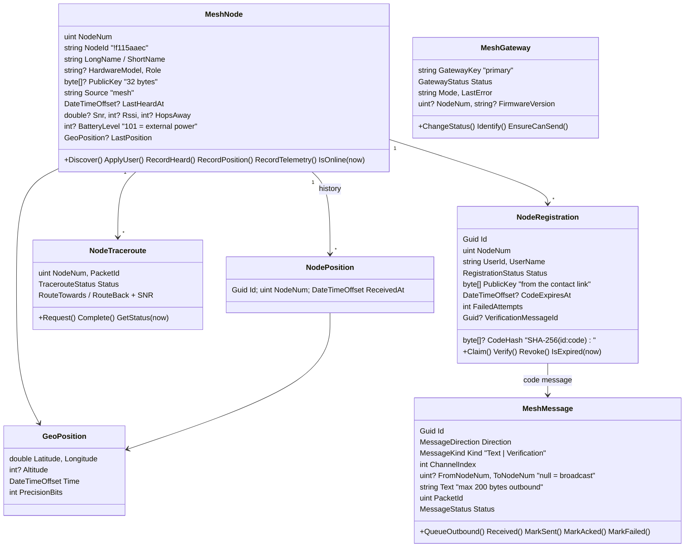
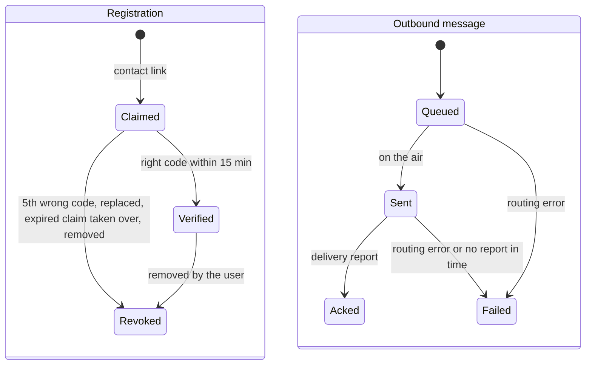

# Mesh — talking to the Meshtastic network

Meshtrail reaches a LoRa mesh of Meshtastic devices through **one gateway node** on the local WiFi. This module
covers everything from the bytes on the TCP socket up to the operations map: node discovery, registering nodes to
users, and chat (channel and direct messages) with delivery tracking. It works with every
Meshtastic device on stock firmware ≥ 2.5, not only Meshtrail devices. Why it is built this way:
[decision record](../Research/2026-10-03-mesh-gateway-decisions.md).

## Where everything lives

| Piece | Location |
|---|---|
| Protocol (`.proto`, tag **v2.8.1**, GPL-3.0) | `Code/Libraries/Meshtrail.Mesh/Protos/meshtastic/` |
| Meshtrail SOS payload (`MeshtrailBeacon`) | `Code/Libraries/Meshtrail.Mesh/Protos/meshtrail/beacon.proto` |
| Stream framing | `Meshtrail.Mesh/Framing/` (`FrameReader`, `FrameWriter`, `MeshFrame`) |
| Radio abstraction + implementations | `Meshtrail.Mesh/Radio/` (`IMeshRadio`, `TcpMeshRadio`, `SimulatedMeshRadio`) |
| Protobuf → plain events | `Meshtrail.Mesh/Events/` (`PacketTranslator`, `MeshEvent` records) |
| Outbound packets + rate limit | `Meshtrail.Mesh/Outbound/` (`MeshPackets`, `OutboundRateLimiter`) |
| "Share contact" link parser | `Meshtrail.Mesh/Contacts/ContactUrl.cs` |
| MQTT broker, client + topics (multi-gateway spike) | `Meshtrail.Mesh/Mqtt/` (`MeshtasticMqttBroker`, `MeshtasticMqttClient`, `MeshtasticTopic`) |
| MQTT broker service (AppHost resource `mqtt-broker`) | `Code/Server/Meshtrail.MqttBroker` |
| Domain | `Meshtrail.Core.Domain/Mesh/` (`MeshNode`, `MeshGateway`, `NodePosition`, `NodeTraceroute`, `GeoPosition`, `NodeRegistration`, `MeshMessage`) |
| Use cases | `Meshtrail.Core.Application/UseCases/Mesh/` and `UseCases/Map/` |
| Gateway worker, event → command mapping, health check | `Meshtrail.Core.Infrastructure/Mesh/` |
| Repositories, EF mapping | `Meshtrail.Core.Infrastructure/Repositories/Mesh*`, `Persistence/*Mesh*`, `*Node*` |
| Controllers | `Meshtrail.WebApi/Controllers/` (`GatewayController`, `NodesController`, `MapController`, `RegistrationsController`, `MessagesController`) |
| Contact link / code adapters | `Meshtrail.Core.Infrastructure/Mesh/` (`ContactUrlParser`, `RandomVerificationCodeGenerator`) |
| Angular | `Client-Web/src/app/features/operations/` (page, `chat-drawer`, `registration-dialog`), map wrapper `src/app/core/map/` |
| Tests | `Code/Tests/Meshtrail.Core.UnitTests/Mesh/`, `Code/Tests/Meshtrail.Core.IntegrationTests/Mesh/` |

`Meshtrail.Mesh` references nothing from `Meshtrail.Core`, so it can be used on its own (the broker service does).
Infrastructure adapts it to the application.

## Architecture



- The worker owns the radio. It never throws: a failed packet is logged and skipped; a lost connection is retried.
- Handlers never touch the radio: they queue work through `IMeshGateway` (Application port, implemented by
  `MeshGatewayService`). The worker sends queued requests no faster than `Meshtastic:Outbound:MinInterval`.
- We pick packet ids ourselves (`MeshPackets.NewPacketId`), so an answer (`request_id`) can be matched to a request
  that was stored before it was sent (traceroutes, messages).
- Local admin messages to our own gateway (`add_contact`) do not go on the air and skip the rate limit.

### Sending a message



- **Acked** for a direct message only when the destination itself confirms; an "implicit" ack from a relay or our
  own gateway only means the packet left, so it stays Sent. For a channel message any confirmation counts.
- A routing error (`MaxRetransmit`, `NoRoute`, ...) makes it **Failed** with that reason. No report within
  `Meshtastic:Outbound:AckTimeout` (default 90 s; checked every 15 s) makes it Failed "No delivery confirmation".
- Messages queued while the gateway was offline stay **Queued** in the database and are queued again on every
  (re)connect (`RequeuePendingMessages`). The in-memory queue ignores a message it already holds, so nothing goes
  out twice.

### Registering a node



The key is handed to the gateway only **after** verification: a forged link could otherwise make the gateway
encrypt messages for the wrong device. A link whose key differs from the key the node itself broadcasts is refused.

### Gateway connection



The status is stored in `MeshGateways` (for the API) and kept in memory for the `mesh-gateway` health check.
That check reports **Degraded** (never Unhealthy) while offline, so `/health/ready` stays 200.

## The TCP stream protocol



Every frame is `0x94 0xC3`, then the payload length as 2 bytes big-endian (max 512), then the protobuf.
`FrameReader` keeps leftovers between reads, skips anything before a start marker (debug text, corrupt bytes)
and throws away a header that claims more than 512 bytes, then looks for the next marker.

The node accepts **one TCP client at a time**. When the phone app connects over WiFi, we are disconnected and
`ReadAllAsync` ends; the worker reconnects later.

### What we do with incoming messages

| From the radio | Event | Command |
|---|---|---|
| `my_info`, `metadata` | `GatewayInfoReceived` | `RecordGatewayInfo` |
| `node_info` (config dump) | `NodeInfoReceived` | `RecordNodeInfo` |
| any packet (also encrypted ones) | `NodeHeard` | `RecordNodeHeard` |
| `NODEINFO_APP` | `NodeUserReceived` | `RecordNodeUser` |
| `POSITION_APP` with a fix | `PositionReceived` | `RecordPosition` |
| `TELEMETRY_APP` device metrics | `TelemetryReceived` | `RecordTelemetry` |
| `TRACEROUTE_APP` with `request_id` | `TracerouteReceived` | `RecordTracerouteResult` |
| `TEXT_MESSAGE_APP` | `TextReceived` (raw text) | `ReceiveTextMessage` (stored once per sender + packet id) |
| `ROUTING_APP` with `request_id` | `RoutingReceived` | `RecordRoutingResult` |
| config, channels (with keys), module config, logs | — | ignored |

Packets from the gateway itself get no SNR/RSSI (they did not travel over the air). Hops away = `hop_start − hop_limit`.

## Domain model





Rules worth knowing:

- Everything from the radio is untrusted: names are cleaned (control characters removed, max 40 / 10 characters),
  battery is clamped to 0–101, keys that are not 32 bytes are ignored, routes are cut at 8 hops.
- Older reports never overwrite newer ones (last heard, position time). A "heard" time more than a minute in the
  future (drifting device clock) is replaced by our own time.
- Online = heard in the last 15 minutes (`MeshNode.OnlineWindow`; the client uses the same rule).
- Battery 101 means "on external power" (`IsExternalPower`); the UI shows that instead of a percentage.
- A traceroute without an answer after 2 minutes shows as `TimedOut` (derived, not stored).
- Requests to the mesh need an Online gateway (`MeshGateway.EnsureCanSend` → 422 otherwise).
- One active (Claimed or Verified) registration per node, also enforced by a filtered unique index. A new claim
  replaces your own earlier claim or an expired claim of someone else; an active claim of someone else or any
  verified registration blocks it (422).
- A code is 6 digits, valid 15 minutes, max 5 attempts. Only its hash is stored; wrong attempts are saved before the
  422 answer, so they cannot be retried endlessly.
- Outbound text is at most 200 bytes UTF-8 (`MeshMessage.TextMaxBytes`; the validator and the client counter use the
  same limit). Direct messages always use channel 0; the firmware encrypts them with the node's key when it knows it.
- Inbound text is cleaned (control characters removed) and cut to 256 characters.

## Database schema

Node numbers are uint32, stored as `BIGINT` (they do not fit in `INT`). Scripts: `Code/Database/Meshtrail.Database/dbo/Tables/`.

**MeshGateways** — `GatewayKey` NVARCHAR(50) PK, `Mode` NVARCHAR(20), `Status` NVARCHAR(20), `StatusChangedAt`,
`LastConnectedAt` NULL, `LastError` NVARCHAR(500) NULL, `NodeNum` BIGINT NULL, `FirmwareVersion` NVARCHAR(50) NULL.

**MeshNodes**

| Column | Type | Null | Notes |
|---|---|---|---|
| NodeNum | BIGINT | no | PK (clustered) |
| NodeId | NVARCHAR(9) | no | `!` + 8 hex digits |
| LongName / ShortName | NVARCHAR(40) / NVARCHAR(10) | no | firmware defaults until the node sends its user info |
| HardwareModel / Role | NVARCHAR(50) / NVARCHAR(30) | yes | |
| PublicKey | VARBINARY(32) | yes | public by design |
| Source | NVARCHAR(20) | no | `mesh` |
| FirstSeenAt / LastHeardAt | DATETIMEOFFSET | no / yes | index on LastHeardAt |
| Snr, Rssi, HopsAway | FLOAT, INT, INT | yes | |
| BatteryLevel, Voltage | INT, FLOAT | yes | 101 = external power |
| Latitude, Longitude, Altitude, PositionTime, PositionPrecision | | yes | last fix |
| UpdatedAt | DATETIMEOFFSET | no | |

**NodePositions** — `Id` GUID PK (nonclustered), `NodeNum` FK, `Latitude`, `Longitude`, `Altitude` NULL,
`PositionTime` NULL, `Precision`, `ReceivedAt`. Clustered on (`NodeNum`, `ReceivedAt`), index on `ReceivedAt`
for the retention job.

**NodeTraceroutes** — `Id` GUID PK, `NodeNum` FK, `PacketId` BIGINT (indexed), `Status`, `RequestedAt`,
`RequestedBy`, `CompletedAt` NULL, `RouteTowards` / `SnrTowards` / `RouteBack` / `SnrBack` NVARCHAR(400)
(comma-separated, empty SNR = unknown).

**NodeRegistrations** — `Id` GUID PK, `NodeNum` FK, `UserId`, `UserName`, `Status`, `PublicKey` VARBINARY(32),
`LongName`, `ShortName`, `CodeHash` VARBINARY(32) NULL, `CodeExpiresAt` NULL, `FailedAttempts`,
`VerificationMessageId` NULL, `ClaimedAt`, `VerifiedAt` NULL, `RevokedAt` NULL, `RevokedReason` NULL, `RowVersion`.
Unique filtered index on `NodeNum` where `Status IN ('Claimed','Verified')`; index on `UserId`.

**MeshMessages** — `Id` GUID PK, `Direction`, `Kind`, `ChannelIndex`, `FromNodeNum` NULL, `ToNodeNum` NULL
(NULL = broadcast), `Text` NVARCHAR(256), `PacketId` BIGINT, `Status`, `FailureReason` NULL, `Snr`, `Rssi`,
`HopsAway`, `CreatedAt`, `CreatedBy` NULL, `SentAt` NULL, `AckedAt` NULL. Indexes: channel + time (broadcasts),
from/to + time (conversations), packet id (delivery reports), status (outbound).

## API (`api/v1`)

| Endpoint | Result |
|---|---|
| `GET gateway` | `GatewayStatusDto` (status, mode, last error, node id, firmware) |
| `POST gateway/reconnect` | 202; new status arrives via SignalR |
| `GET nodes?page&pageSize&search&online&registered` | `PagedResult<NodeDto>`, most recently heard first (max 500 per page) |
| `GET nodes/{nodeNum}` | `NodeDetailDto` (node + last traceroute); 404 if unknown |
| `POST nodes/{nodeNum}/position-request` | 202; the answer updates the node (NodeUpdated) |
| `POST nodes/{nodeNum}/traceroute` | 202 + pending `NodeTracerouteDto`; result via TracerouteCompleted |
| `GET map/features?bbox=w,s,e,n&layers=nodes` | GeoJSON FeatureCollection |
| `GET registrations` | the current user's Claimed/Verified registrations |
| `POST registrations/from-contact-url` `{url}` | 201 Claimed registration; the code goes out by direct message |
| `POST registrations/{id}/verify` `{code}` | Verified registration; 422 "Wrong code. N attempts left." |
| `DELETE registrations/{id}` | 204 |
| `GET messages?channel=0` or `?node={nodeNum}` (`page`, `pageSize` max 200) | `PagedResult<MessageDto>`, newest first; verification messages are left out |
| `POST messages` `{channelIndex?, toNodeNum?, text}` | 202 + Queued `MessageDto` |

Errors: 400 validation (e.g. broadcast address `4294967295`, text over 200 bytes, both `channel` and `node`),
404 unknown node or registration (someone else's registration also answers 404), 422 business rule (gateway not
online, wrong code, node already registered), 409 two people registering the same node at the same moment.

### Realtime (SignalR `/hubs/notifications`)

| Event | Payload | When |
|---|---|---|
| `NodeUpdated` | `NodeDto` | after any change to a node |
| `GatewayStatusChanged` | `GatewayStatusDto` | connection state or gateway identity changed |
| `TracerouteCompleted` | `NodeTracerouteDto` | answer to a traceroute arrived |
| `MessageReceived` | `MessageDto` | a text arrived from the mesh |
| `MessageStatusChanged` | `MessageDto` | one of our messages was queued, sent, acked or failed (verification messages included, text hidden) |

### Map layers

`GET map/features` asks every registered `IMapLayerSource` (Application, `UseCases/Map/`) for features. Today there
is one layer, `nodes`. Feature ids are `<layer>:<id>`; every feature has `layer` and `source` properties. A new
layer (tracking, external feeds) = a new `IMapLayerSource` registered in `AddApplication`; the endpoint and the
client's layer toggles stay the same. The mesh domain knows nothing about the map.

## Operations map (Angular)

`/operations` (start page): top bar with the gateway chip (Reconnect button when offline), **Register node** and
node counts; left panel with layer toggles and the node list (search, online dot, GW and REG badges); centre the
topo map; right the node detail with **Message**, **Request position**, **Traceroute** and **Register**; bottom the
chat drawer. Everything updates via SignalR, nothing polls.

- **Chat drawer**: tab "Channel 0" plus one tab per direct-message conversation (opened from the node detail, or
  automatically when a direct message arrives). Unread counters on closed tabs, a live byte counter (200 max; it
  counts UTF-8 bytes, so an emoji counts 4) and status marks on our messages: `…` queued, `✓` sent, `✓✓` acked,
  `!` failed (hover for the reason).
- **Registration dialog**: paste the contact link, see live whether the code reached the node, type the code.
  QR scanning comes with the mobile app.

- `core/map/map-view.ts` is the **only** code that uses MapLibre, so the map library can be swapped in one place.
- Style: `environment.mapStyleUrl`; empty = built-in OpenTopoMap raster style (needs internet; offline tiles later).
- MapLibre's web worker is copied to `/maplibre/` by `angular.json`. A web server must serve `.mjs` files as
  `text/javascript`, otherwise the map stays empty ("Worker failed to load").
- Marker colour by last heard: green < 15 min, yellow < 2 h, orange < 24 h, grey older/never.
- Radio texts are always rendered with interpolation, never as HTML.

## MQTT gateways (spike)

The platform is moving to **many gateways over MQTT** ([decision](../Research/2026-10-06-multi-gateway-mqtt.md),
[broker as a service](../Research/2026-10-06-mqtt-broker-service.md)). Today the broker exists; the API still uses
one TCP/simulated gateway. To look inside, use **MQTT Explorer** (or any MQTT client) with the service account.

```
gateway node ──MQTT──▶ Meshtrail.MqttBroker (:1883) ◀──service account── API (next phase), MQTT Explorer
```

- **`Meshtrail.MqttBroker`** (AppHost resource `mqtt-broker`, port 1883, health on http://localhost:5311): a strict
  router. Everything is delivered **except gateway → gateway**: service logins see all uplinks and downlinks; gateways
  only receive what a service login sends (a gateway never receives another gateway's traffic, or it would
  re-transmit it over the air). Gateways may only publish Meshtastic topics and are rate-limited.
  In Development any gateway login is accepted and every uplink is logged (visible in the Aspire dashboard).
- **`MeshtasticMqttClient`** logs in with the service account, receives all uplinks and publishes downlinks.
- **`MeshtasticTopic`** parses `<root>/2/<e|json|map|stat>/...`; the root is configurable per node.

Configuration (`MqttBroker` section of the broker service):

| Key | Default | Meaning |
|---|---|---|
| `Port` / `BindAddress` | `1883` / `0.0.0.0` | Where gateways connect |
| `ServiceUserName` / `ServicePassword` | `meshtrail-api` / — | Login of the API (and of MQTT Explorer when debugging). Password is a secret; Development uses `dev-only-service-password` |
| `AllowAnyGateway` | `false` (`true` in Development) | Accept any gateway login until gateways get their own credentials |
| `MaxMessagesPerSecondPerGateway` | `20` | Extra messages are dropped |
| `LogUplinks` | `false` (`true` in Development) | One log line per uplink |

Try it with a real node:

1. Start the AppHost (or `dotnet run --project Code/Server/Meshtrail.MqttBroker`). Allow port 1883 in the Windows
   firewall.
2. On the node (Meshtastic app → Module config → MQTT): enabled, server address = your PC's IP, any
   username/password, **encryption off**, JSON off, TLS off. Primary channel: uplink and downlink on.
   (The node's MQTT is independent of its TCP API, so Home Assistant can stay connected over TCP.)
3. Watch the `mqtt-broker` log in the dashboard: one readable line per uplink
   (`Uplink from <client>: Envelope on LongFast: !a0b1c2d3 -> all TextMessageApp`).
4. For the raw messages use **MQTT Explorer**: host `localhost`, port `1883`, no TLS, username `meshtrail-api`,
   password `dev-only-service-password` (Development). With any other login the broker treats you as a gateway and
   you see nothing. Envelope payloads are binary protobuf (shown as hex); JSON and `stat` topics are readable text.

## Simulator

`SimulatedMeshRadio` fakes a gateway (`!5101aaec`) and five nodes around Belgium (Brussels, Ghent, Durbuy,
La Roche, Bouillon). On connect it sends the same config dump a real node sends. Then, every
`SimulatorTickInterval`, a random node moves ~50 m and sends a position, a battery report or a chat line.
It answers what we send: routing ACKs for messages (`MAX_RETRANSMIT` for unknown nodes), "Copy." replies to DMs,
positions for position requests, a route for traceroutes. `RaiseSos(nodeNum?)` makes a node send an SOS text.
Development uses it by default (`appsettings.Development.json`).

A fake node has no screen, so the simulator **logs** (Information level, in the API log / Aspire dashboard):

- each fake node's contact link on connect (`Simulator: contact link of Sim Ghent: https://meshtastic.org/v/#...`),
- every direct message a fake node receives, including verification codes.

To try the registration flow without hardware: copy a contact link from the log, paste it in the dialog, then copy
the code from the log. This logging exists only in the simulator.

## Configuration

| Key | Default | Meaning |
|---|---|---|
| `Meshtastic:Gateway:Mode` | `Tcp` (`Simulated` in Development) | `Tcp` = real node, `Simulated` = fake mesh |
| `Meshtastic:Gateway:Host` | — | IP or host name of the gateway node. **User secrets only, never committed** |
| `Meshtastic:Gateway:Port` | `4403` | Meshtastic TCP API port |
| `Meshtastic:Gateway:HeartbeatInterval` | `00:05:00` | Heartbeat so the node keeps the connection open |
| `Meshtastic:Gateway:ConnectTimeout` | `00:00:10` | Give up a connection attempt after this |
| `Meshtastic:Gateway:SimulatorTickInterval` | `00:00:15` | How often the simulator invents traffic |
| `Meshtastic:Outbound:MinInterval` | `00:00:10` | Minimum pause between two packets we send (EU868 duty cycle) |
| `Meshtastic:Outbound:AckTimeout` | `00:01:30` | A sent message without a delivery report after this long becomes Failed |
| `Meshtastic:Retention:PositionDays` | `30` | Position history older than this is deleted |
| `Jobs:NodePositionRetention:Enabled` / `Cron` | `true` / `15 3 * * *` | Schedule of that clean-up |

With `Mode=Tcp` and no `Host`, the gateway stays Offline with "No gateway host configured" (the API still works).

## Connecting a real node

1. Flash stock Meshtastic firmware (≥ 2.5) and set region `EU_868` with the phone app over Bluetooth or USB.
2. In the app: *Config → Network*: enable WiFi, enter SSID and password. On ESP32 boards **WiFi switches Bluetooth
   off**, so do all other configuration first (or use USB / the web client afterwards).
3. Find the node's IP address (router DHCP list) and give it a fixed lease.
4. Point the API at it:
   ```bash
   dotnet user-secrets set "Meshtastic:Gateway:Mode" "Tcp" --project Code/Server/Meshtrail.WebApi
   dotnet user-secrets set "Meshtastic:Gateway:Host" "<node-ip>" --project Code/Server/Meshtrail.WebApi
   ```
5. Do not connect the phone app (or Home Assistant) over WiFi/TCP at the same time: the node only serves one TCP
   client. If it took over, close it and press **Reconnect** in the top bar. MQTT does not have this limit.

## Security

- Channel keys (PSKs) are never logged or stored: channel and config frames are ignored.
- Public keys of nodes are public and may be stored.
- Verification codes are stored only as a hash (salted with the registration id) and compared in constant time.
  The text of the code message is never returned by the API or pushed to clients (shown as "Verification code").
- Registrations are per user: verifying or removing someone else's registration answers 404.
- Text and names arriving from the radio are untrusted input: cleaned and length-limited in the domain, and never
  rendered as HTML.
