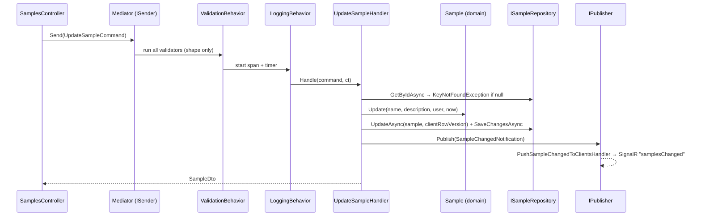
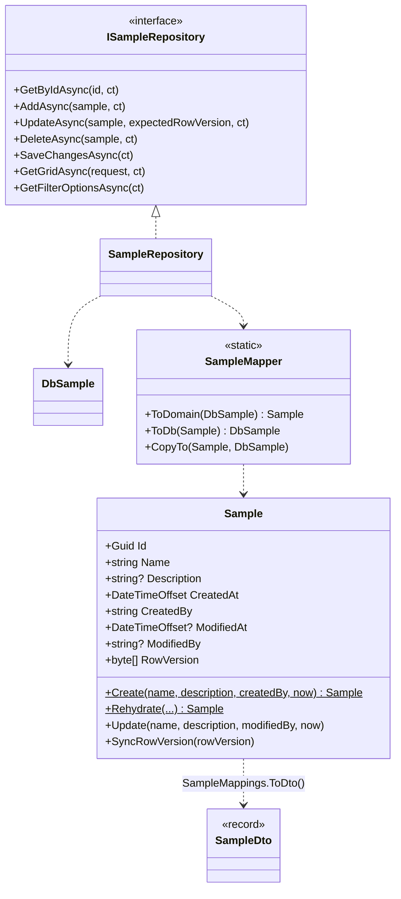

# Samples — the reference module

`Samples` is a deliberately small but **complete** vertical slice. Every skill points here: when you build a real
feature, copy the matching file from this module. It will be renamed or removed once the real domain is described.

A sample has an `Id`, `Name`, `Description`, audit fields (`CreatedAt/By`, `ModifiedAt/By`) and a `RowVersion` for
optimistic concurrency. Use cases: Create, Update, Delete, GetById, a paged/filtered/sorted grid, and filter options.

## Where everything lives

| Layer | Files |
|---|---|
| Domain | `Code/Libraries/Meshtrail.Core.Domain/Samples/Sample.cs` (rules), `Common/DomainException.cs` |
| Contracts | `Code/Libraries/Meshtrail.Core.Contracts/Samples/SampleContracts.cs`, `Common/PagedResult.cs` |
| Application | `Code/Libraries/Meshtrail.Core.Application/UseCases/Samples/` — one folder per use case (`Commands/CreateSample/{Command,Handler,Validator}.cs` …), `SampleMappings.cs`, `Events/` |
| Repository interface | `Code/Libraries/Meshtrail.Core.Application/Repositories/ISampleRepository.cs` |
| Infrastructure | `Persistence/Entities/DbSample.cs`, `Persistence/Configurations/DbSampleConfiguration.cs`, `Persistence/Mappers/SampleMapper.cs`, `Repositories/SampleRepository.cs`, `Jobs/SampleStatisticsJob.cs` |
| Database | `Code/Database/Meshtrail.Database/dbo/Tables/Samples.sql`, `Seed/Seed_Core.sql`, listed in `Code/Database/Scripts_Core.txt` |
| API | `Code/Server/Meshtrail.WebApi/Controllers/SamplesController.cs` → `api/v1/samples` |
| Unit tests | `Code/Tests/Meshtrail.Core.UnitTests/Samples/` (domain, handlers, validators + `SampleTestHelpers.cs`) |
| Integration tests | `Code/Tests/Meshtrail.Core.IntegrationTests/Samples/SamplesApiTests.cs` |
| Angular | `Client-Web/src/app/features/samples/` (list, detail, API service, models, routes) |

## Request flow

## Class diagram

## Database schema

`dbo.Samples` (`Code/Database/Meshtrail.Database/dbo/Tables/Samples.sql`):

| Column | Type | Null | Notes |
|---|---|---|---|
| `Id` | `UNIQUEIDENTIFIER` | no | PK (non-clustered). Generated by the domain as GUID v7 |
| `Name` | `NVARCHAR(200)` | no | Indexed (`IX_Samples_Name`) |
| `Description` | `NVARCHAR(2000)` | yes | |
| `CreatedAt` | `DATETIMEOFFSET(7)` | no | Clustered index — new rows append at the end |
| `CreatedBy` | `NVARCHAR(256)` | no | From `ICurrentUser.Name` |
| `ModifiedAt` | `DATETIMEOFFSET(7)` | yes | |
| `ModifiedBy` | `NVARCHAR(256)` | yes | |
| `RowVersion` | `ROWVERSION` | no | Optimistic concurrency token |

## Optimistic concurrency

1. `GET` returns `rowVersion` as base64.
2. The client sends it back unchanged in `PUT`.
3. `SampleRepository.UpdateAsync` sets it as EF's *original* value, so the UPDATE only matches if nobody changed the row.
4. No match → `DbUpdateConcurrencyException` → `ConcurrencyException` (Application) → **HTTP 409**.
5. The Angular detail page shows "changed by someone else" with a **Reload latest version** button.

## Realtime

After every successful save the handlers publish `SampleChangedNotification`. `PushSampleChangedToClientsHandler`
forwards it through `IRealtimeNotifier` (SignalR) as `samplesChanged`; the Angular list reloads its current page.

## Background job example

`SampleStatisticsJob` (cron, `Jobs:SampleStatistics` in appsettings, enabled in Development) sends
`GetSampleGridQuery` through Mediator and logs the total. It shows that jobs reuse use cases instead of duplicating logic.
